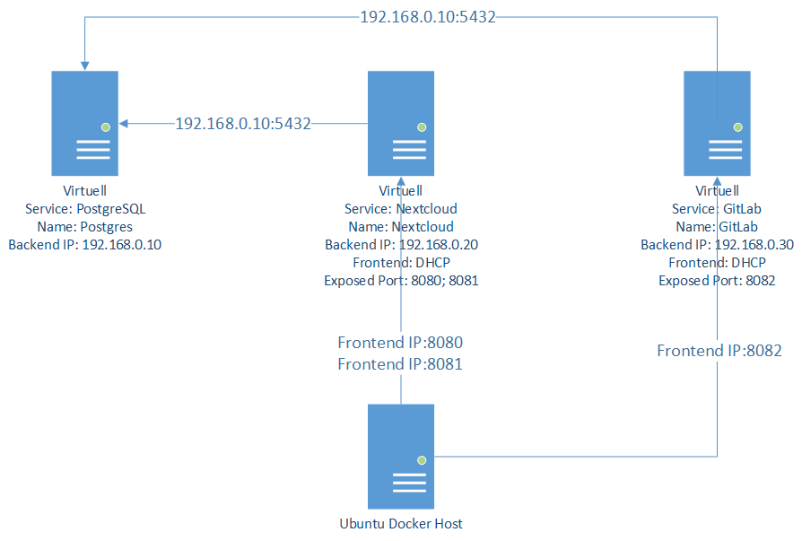

# M300-Docker

## Servicebeschreibung

Für den Docker teil habe ich zwei Services gemacht, welche ihre Daten auf dem gleichen Datenbankserver abspeichern.
Beide Services und auch der Datenbank Server speichern Ihre Daten und Konfigurationen in persistenten Volumes ab.

 

### MySQL

For PostgreSQL wollte ich MySQL als Datenbank für Nextcloud und GitLab nutzen.
Nachdem MySQL fertig war, musste ich feststellen, das GitLab, MySQL nicht wirklich unterstützt und es viel einfacher ist, PostgreSQL zu verwenden.

 

### PostgreSQL

PostgreSQL ist der Datenbank Server. Ich habe aus dem Dockerhub ein fertiges Image genommen und state den Service mittels Docker-Compose.
Beim Start des Containers wird ein Netzwerk hinzugefügt:
- InternalNetwork (Backend)

Neben den Netzwerken wird auch ein Init.sh Script geladen, damit die Datenbanken und User für Nextcloud und GitLab erstellt werden.
Damit die Daten persistent sind, werden die Datenbanken auf ein attachtes Volume gespeichert.

 

### GitLab

GitLab war der zweite Service, welchen ich zum laufen bringen wollte.
GitLab habe ich auch als vollständiges Image aus dem DockerHub heruntergeladen und mittels Docker-Compose gestartet.
Beim Start des Containers werden zwei Netzwerke hinzugefügt:
- InternalNetwork (Backend)
- Bridge (Frontend)

Um den Service zu konfigurieren, müssen alle wichtigen Parameter in einer Umgebungsvariablen hinterlegt werden.
Damit die Daten persistent sind, werden die Daten und Konfigurationen auf attachte Volumes 
gespeichert.

 

### Nextcloud

Nextcloud habe ich selber mit einem Dockerfile erstellt.
Beim builden des Containers werden Apache, PHP und weitere bennötigte abhängigkeiten installiert und konfiguriert.
Nach der Konfiguration wird Nextcloud heruntergeladen, entpackt und die entsprechenden Berechtigungen gesetzt.
Beim Builden des Containers werden zwei Netzwerke hinzugefügt:
- InternalNetwork (Backend)
- Bridge (Frontend)

Damit die Daten persistent sind, werden die Daten und Konfigurationen auf attachte Volumes gespeichert.
Biem Start des Containers wird, falls noch nicht vorhanden, die Datenbank initialisiert.
Falls dies bereits getant wurde, wird lediglich wieder alles geladen.

 

# Volumes

## MySQL

**Datenbank Daten**

    docker volume create    --driver local \
                            --label MySQLDataVol \
                            --opt type=ext4 \
                            --opt device=:/Docker/MySQL/Volumes/Data \
                            mysqldata-vol

## PostgreSQL

**Datenbank Daten**

    docker volume create    --driver local \
                            --label PostgresDataVol \
                            --opt type=ext4 \
                            --opt device=:/Docker/Postgres/Volumes/Data \
                            postgresdata-vol

## Nextcloud

**Daten**

    docker volume create    --driver local \
                            --label NextcloudDataVol \
                            --opt type=ext4 \
                            --opt device=:/Docker/Nextcloud/Volumes/Data \
                            nextclouddata-vol
							

**Konfigurationen**

    docker volume create    --driver local \
                            --label NextcloudConfigVol \
                            --opt type=ext4 \
                            --opt device=:/Docker/Nextcloud/Volumes/Config \
                            nextcloudconfig-vol

## GitLab

**Konfiguration**

    docker volume create    --driver local \
                            --label GitHubConfigVol \
                            --opt type=ext4 \
                            --opt device=:/Docker/GitLab/Volumes/Config \
                            gitlabconfig-vol

    docker volume create    --driver local \
                            --label GitHubLogsVol \
                            --opt type=ext4 \
                            --opt device=:/Docker/GitLab/Volumes/Logs \
                            gitlablogs-vol

    docker volume create    --driver local \
                            --label GitHubDataVol \
                            --opt type=ext4 \
                            --opt device=:/Docker/GitLab/Volumes/Data \
                            gitlabdata-vol
							
 

# Docker-Compose
## YML Datei
	version: "3"
	services:
		PostgreSQL:
			container_name: Postgres-SQL
			image: "postgres:latest"
			hostname: 'postgres-srv'

			# Set admin username and password
			environment:
			- POSTGRES_USER=root
			- POSTGRES_PASSWORD=":~D,(A~B?r~1A2ISV<In"

			volumes:
			# Script for initializing the database and users
			- /Docker/Postgres/Scripts/Init.sh:/docker-entrypoint-initdb.d/Init.sh
			# Configurationfile of postgreSQL
			- /Docker/Postgres/Scripts/postgresql.conf:/etc/postgresql/postgresql.conf
			# Volume to store the database data
			- /Docker/Postgres/Volumes/Data:/var/lib/postgresql/data

			networks:
			# Backend network with static ip
			InternalNetwork:
				ipv4_address: 192.168.0.10
				
		
		GitLab:
			container_name: GitLab-SRV
			image: "gitlab/gitlab-ce:latest"
			restart: always
			hostname: 'gitlab-srv'

			environment:
			GITLAB_OMNIBUS_CONFIG: |
				# Whitelisted url
				external_url 'http://192.168.10.66'
				# root password
				gitlab_rails['initial_root_password'] = 'Test1234'
				# PostgreSQL database configuration
				postgresql['enable'] = false
				gitlab_rails['db_adapter'] = 'postgresql'
				gitlab_rails['db_encoding'] = 'unicode'
				gitlab_rails['db_database'] = 'gitlab'
				gitlab_rails['db_password'] = 'oIwhR58Z0spnnez0Ouhj'
				gitlab_rails['db_host'] = '192.168.0.10'
				gitlab_rails['db_port'] = 5432
			
			volumes:
			# Persistent Data; Logs; Configs
			- /Docker/GitLab/Volumes/Config:/etc/gitlab
			- /Docker/GitLab/Volumes/Logs:/var/log/gitlab
			- /Docker/GitLab/Volumes/Data:/var/opt/gitlab
			
			ports:
			- "8083:80"
			
			networks:
			# Backend
			InternalNetwork:
				ipv4_address: 192.168.0.30
			# Frontend
			default:
			
			# Container starts after PostgreSQL
			depends_on:
			- PostgreSQL
			
		
		nextcloud:
			container_name: Nextcloud
			build:
			context: ./../Nextcloud
			dockerfile: Dockerfile
			
			# Save Data and Configs on volumes
			volumes:
			- /Docker/Nextcloud/Volumes/Data:/Nextcloud
			- /Docker/Nextcloud/Volumes/Config:/var/www/html/config
			
			ports:
			- "8080:80"
			- "8081:443"
			
			networks:
			# Backend
			InternalNetwork:
				ipv4_address: 192.168.0.20
			# Frontend
			default:
			
			# Starts after PostgreSQL
			depends_on:
			- PostgreSQL
			
			
		# Only for datatbase testing
		# pt:
			# container_name: pt
			# image: "postgres:latest"
			# environment:
			# - POSTGRES_USER=root
			# - POSTGRES_PASSWORD=":~D,(A~B?r~1A2ISV<In"
			# volumes:
			# - /Docker/Postgres/Scripts/Init.sh:/docker-entrypoint-initdb.d/Init.sh
			# - /Docker/Postgres/Scripts/postgresql.conf:/etc/postgresql/postgresql.conf
			# # - /Docker/Postgres/Volumes/Data:/var/lib/postgresql/data
			# networks:
			# InternalNetwork:
				# ipv4_address: 192.168.0.40
			# default:
			
		
		networks:
		# Backend network definition
		InternalNetwork:
			driver: bridge
			ipam:
			config:
			- subnet: 192.168.0.0/24

 

# Nextcloud

## DockerFile

Im Buildvorgang werden alle abhängigkeiten bnnötigte und Tools installiert.
Beim Start des Containers wird die Datenbank initialisiert, sofern dies noch nicht getan wurde.
Falls die Initialisierung bereits erfolgt war, werden die Daten lediglich geladen.

** DockerFile **
    FROM ubuntu:18.04

    COPY ./Scripts/NextcloudInstall.sh /app/NextcloudInstall.sh
    COPY ./Scripts/NextcloudStart.sh /app/NextcloudStart.sh

    ENV TZ=Europe/Zurich
    RUN ln -snf /usr/share/zoneinfo/$TZ /etc/localtime && echo $TZ > /etc/timezone \
    && chmod +x /app/NextcloudInstall.sh \
    && chmod +x /app/NextcloudStart.sh \
    && /bin/bash /app/NextcloudInstall.sh

    CMD /bin/bash /app/NextcloudStart.sh

    EXPOSE 80/tcp
    EXPOSE 80/udp

    EXPOSE 443/tcp
    EXPOSE 443/udp

 

**NextcloudInstall.sh**

    #!/bin/bash

    # Install apache2 and PHP 7
    apt-get update
    apt-get install sudo wget apache2 libapache2-mod-php7.2 -y
    apt-get install php7.2-gd php7.2-json php7.2-pgsql php7.2-curl php7.2-mbstring -y
    apt-get install php7.2-intl php-imagick php7.2-xml php7.2-zip -y

    # Download and extract nextcloud
    cd /var/www/html
    # Empty the directory
    rm -r -f *
    # Get nextcloud
    wget https://download.nextcloud.com/server/releases/nextcloud-15.0.5.tar.bz2 -O nextcloud.tar.bz2
    tar -xjf nextcloud.tar.bz2

    mv nextcloud/* ./

    # Remove unnecessary files
    rm -f -r nextcloud.tar.bz2
    rm -f -r nextcloud

    # Set the rights
    chown -R www-data:www-data /var/www/html
    chmod 750 /var/www/html -R

    # Create a data folder an set the rights
    mkdir /Nextcloud
    chown www-data:www-data /Nextcloud
    chmod 750 /Nextcloud

    # Backup config files
    mkdir /Backup
    cp -r /var/www/html/config /Backup

    # Generate ssl cert
    mkdir /etc/apache2/ssl
    openssl req -x509 -newkey rsa:4096 -nodes -days 730 -keyout /etc/apache2/ssl/ssl.key -out /etc/apache2/ssl/ssl.crt -subj "/C=CH/ST=Zuri                                                                                                                      ch/L=Switzerland/O=TBZ/CN=192.168.10.66"

    # Set the nextcloud apache2 configs
    echo "

    <Directory /var/www/html/>
    Options +FollowSymlinks
    AllowOverride All

    <IfModule mod_dav.c>
    Dav off
    </IfModule>

    # Set environment vars for apache2
    SetEnv HOME /var/www/html
    SetEnv HTTP_HOME /var/www/html

    </Directory>" > "/etc/apache2/sites-available/nextcloud.conf"

    # Set the ssl configs
    echo "
    <VirtualHost *:443>
    DocumentRoot /var/www/html
    SSLEngine on
    SSLCertificateFile /etc/apache2/ssl/ssl.crt
    SSLCertificateKeyFile /etc/apache2/ssl/ssl.key
    </VirtualHost>" >> /etc/apache2/sites-enabled/000-default.conf

    # Enable the nextcloud apache2 configs
    a2ensite nextcloud.conf

    # Enable the ssl mode
    a2enmod ssl

    # Reload the apache2 server
    service apache2 restart

 

**NextcloudStart.sh**

    #!/bin/bash

    # Wait for database
    sleep 10

    # Static vars
    NextCloudConfigDir="/Nextcloud"
    NextcloudPreconfigured=false

    # Check if configurations are present
    if find "$NextCloudConfigDir" -mindepth 1 -print -quit 2>/dev/null | grep -q .; then
        NextcloudPreconfigured=true
    fi

    if ! $NextcloudPreconfigured ; then
        # Restore config files
        cp -r /Backup/* /var/www/html/config
        # Set rights
        chown www-data:www-data /var/www/html/config -R
        chmod 750 /var/www/html/config -R
        chown www-data:www-data /Nextcloud -R
        chmod 760 /Nextcloud -R

        # Configure nextcloud service
        sudo -u www-data php /var/www/html/occ maintenance:install --database "pgsql" --database-name "nextcloud" --database-user "nextcloud" --database-pass "KkJyCtwdfjjlAvd-hdPn" --database-host 192.168.0.10 --admin-user "admin" --admin-pass "Test1234" --data-dir "/Nextcloud"
        sudo -u www-data php /var/www/html/occ config:system:set trusted_domains 2 --value=192.168.10.66
    fi

    #service apache2 stop
    /usr/sbin/apache2ctl -DFOREGROUND

 

# Kubernetes
Neben Docker habe ich auch noch Kubernetes ausprobiert. Ich habe es nach längerem Debuggen geschaft zwei Ubuntu Hosts in Kubernetes zu verbinden, zwei NginX Webserver instanzen darauf laufen zu lassen, diese mittels eines Loadbalancer Services auf Port 80 zu exposen und alles visuel im Kuberneses-Dashboard anzeigen zu lassen.

Das Kubernetes-Dashboard konnte ich auch von ausserhalb zugreifbar machen und ich habe auch einen "Benutzer" mit eigenem Tocken erstellt, welcher auf das Kubernetes-Dashboard mit allen rechten kommt.

**Kubernetes Installieren**

    ## On Slave and Master ##
    # Turn swap off
    swapoff -a

    nano /etc/fstab

    # Comment the swap line

    apt-get update && apt-get install -y apt-transport-https curl
    curl -s https://packages.cloud.google.com/apt/doc/apt-key.gpg | apt-key add -
    cat <<EOF >/etc/apt/sources.list.d/kubernetes.list
    deb https://apt.kubernetes.io/ kubernetes-xenial main
    EOF
    apt-get update
    apt-get install -y kubelet kubeadm kubectl
    apt-mark hold kubelet kubeadm kubectl

    systemctl daemon-reload
    systemctl restart kubelet

**Cluster erstellen**

    ## On Master ##
    # Initialize Kubeadm
    kubeadm init --pod-network-cidr=10.244.0.0/16

    # Add Flannel network
    kubectl apply -f https://raw.githubusercontent.com/coreos/flannel/a70459be0084506e4ec919aa1c114638878db11b/Documentation/kube-flannel.yml

    # Configure user
    # Exir root first!!
    mkdir -p $HOME/.kube
    sudo cp -i /etc/kubernetes/admin.conf $HOME/.kube/config
    sudo chown $(id -u):$(id -g) $HOME/.kube/config

    ## On Slave ##
    # Joind the master
    # The token, hash, master ip and port are listed on the terminal
    kubeadm join --token <token> <master-ip>:<master-port> --discovery-token-ca-cert-hash sha256:<hash>

 

## Testfälle

| Service | Testfall | Resultat |
|:--:|:--|:--|
Nextcloud | Der Webserver erzwingt eine HTTPS verbindung unter 192.168.10.66:8081. | SSL Verbindung wurde erzwungen und funktioniert.
Nextcloud; PostgreSQL | Mittels dem Benutzer "admin" und dem Passwort "Test1234" kann man sich unter 192.168.10.66:8081 einloggen. | Login war erfolgreich.
Nextcloud; PostgreSQL | Dateien, welche hochgeladen werden, sind nach einem ``docker-compose down && docker-compose up -d`` immernoch vorhanden. | Dateien waren immernoch vorhanden.
GitHub; PostgreSQL | Login unter 192.168.10.66 ist mit dem Benutzer "root" und dem Passwort "Test1234" möglich. |Login war erfolgreich.
GitHub; PostgreSQL | Änderungen in GitHub sind nach ``docker-compose down && docker-compose up -d`` immernoch vorhanden. | Einstellungen waren immernoch gesetzt.

 

# Einrichtung in Docker umgebung

Um die Docker-Compose Datei selber verwenden zu können, wird folgendes bennötigt:

**Ubuntu 1804 Server**
- mindestens 4GB Ram
- mindestens 16GB Festplattenspeicher
- mindestens 1 CPU

Die Datei "Docker" muss im Root-Verzeichis liegen (/Docker). Es müssen vor dem Start von Docker-Compose die Volumes erstellt werden. Die erstellung der Volumes sind unter [Volumes](#Volumes) beschrieben. Damit man auf die Webservices über die Host IP zugreiffen kann, muss man in der Datei ``/Docker/Compose/docker-compose.yml`` unter der GitLab konfiguration die IP von "192.168.10.66" auf die Host IP des Docker Servers ändern. Dies muss auch in der Datei ``/Docker/Nextcloud/Scripts/NextcloudStart.sh`` getant werden.

Nachdem die Umgebung vorbereitet wurde, kann man in das Verzeichnis "/Docker/Compose" navigieren und die drei Services mittels ``docker-compose up -d`` builden und starten.

Die Services sind nach etwa 5 Minuten fertig erstellt (GitLab bennötigt eher lange).

GitLab ist unter "HostIP":8082 erreichbar. Nextcloud HTTP unter "HostIP":8080 und HTTPS unter "HostIP":8081

 

# Netzwerkplan

#### Debugging
    rm -f -r /Docker/Nextcloud/Volumes/*
    rm -f -r /Docker/GitLab/Volumes/*
    rm -f -r /Docker/Postgres/Volumes/*
    rm -f -r /DockerMySQL/Volumes/*

